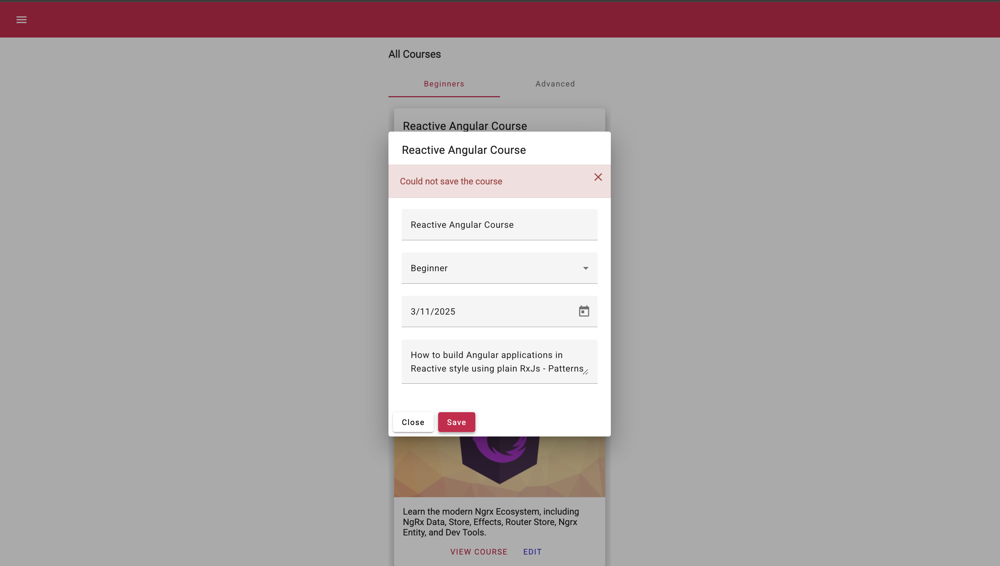

# Angular course: Reactive angular with RxJS
🔗 https://angular-university.io/course/reactive-angular-course
🔗 https://rxjs.dev/

Starting point: $ git clone --branch 1-start https://github.com/angular-university/reactive-angular-course.git

The essential concepts in RxJS which solve async event management are:

- Observable: represents the idea of an invokable collection of future values or events.
- Observer: is a collection of callbacks that knows how to listen to values delivered by the Observable.
- Subscription: represents the execution of an Observable, is primarily useful for cancelling the execution.
- Operators: are pure functions that enable a functional programming style of dealing with collections with operations like map, filter, concat, reduce, etc.
- Subject: is equivalent to an EventEmitter, and the only way of multicasting a value or event to multiple Observers.
- Schedulers: are centralized dispatchers to control concurrency, allowing us to coordinate when computation happens on e.g. setTimeout or requestAnimationFrame or others.

# Stateless Observables Service


## Traditional imperative style

To understand how reactive design works, we first need to understand how the traditional imperative style works.

"In programming, imperative style is a paradigm where code explicitly describes how to achieve a specific result through a sequence of instructions or commands. This is in contrast to declarative style, which focuses on describing what the desired result is, leaving the "how" to the underlying system."

"Imperative code provides clear, sequential instructions, making it:
• Easier to follow for simple tasks.
• Well-suited for scenarios where step-by-step control is essential.

However, it can become verbose and harder to maintain as complexity increases, particularly in asynchronous or reactive programming contexts like Angular."

To kick off the understanding, we start by using the httpClient (Observable based service) to hit our backend.

```ts
export class HomeComponent implements OnInit {
  beginnerCourses: Course[];
  advancedCourses: Course[];

  constructor(private http: HttpClient, private dialog: MatDialog) {}

  ngOnInit() {

    this.http.get('/api/courses')
      .subscribe(
        res => {

          const courses: Course[] = res["payload"].sort(sortCoursesBySeqNo);

          this.beginnerCourses = courses.filter(course => course.category == "BEGINNER");

          this.advancedCourses = courses.filter(course => course.category == "ADVANCED");

        });

  }
```

### proxy.json

Small side note: package.json script "start": "ng serve  --proxy-config ./proxy.json" leverages off the proxy.json file e.g.

```json
{
  "/api": {
    "target": "http://localhost:9000",
    "secure": false
  }
}
```

Meaning when we hit the HTTP Client uses /api, it leverages off the defined target in proxy mode ergo invokes localhost:9000.

```ts
this.http.get('/api/courses').subscribe(..etc)
```

### Observable

The following creates an observable, which allows us to observe the behaviour:

```ts
 ngOnInit() {
    this.http.get('/api/courses')
      .subscribe(
        res => {
          const courses: Course[] = res["payload"].sort(sortCoursesBySeqNo);

          this.beginnerCourses = courses.filter(course => course.category == "BEGINNER");

          this.advancedCourses = courses.filter(course => course.category == "ADVANCED");

        });

  }
```

An observable may emit many values over its lifetime, it also may emit none. We can receive the events emitted by the observable via the callback aka `rest => {}` which responds to any emissions. 

The properties this.beginnerCourses and this.advancedCourses are directly assigned the filtered arrays. This direct manipulation of state reflects a typical imperative approach.

## Refactoring to a stateless observable service

The first potential issue raised with the imperative style is the potential for [Callback hell](https://callbackhell.com/).

There is also too much logic inside the component. The component knows that data is coming from the backend, it also knows how to do the HTTP call and process the data it receives.

Ideally a component shouldn't know where the data is coming from. And also it should be easy to test the component in isolation without having to use a real HTTP backend. 

Another thing is that keeping data in the following immutable properties is problematic as if there is any change in the data locally in the component, there is no way for the application to know the data has been modified:

```ts
beginnerCourses: Course[];
advancedCourses: Course[];
```

Ideally, code should be flat and placed inside an Angular service for reusability. Here is the new CourseService that we created:

```ts
@Injectable({
  providedIn: 'root'
})
export class CourseService {
  constructor(private http: HttpClient) {
    
  }

  loadAllCourses(): Observable<Course[]> {
    return this.http.get<Course[]>("/api/courses")
      .pipe(
        map(res => res["payload"])
      )
  }
}
```

🔗 https://rxjs.dev/api/operators/map

Important, the data is not stored in the service meaning the service is *stateless*. The data returned is only accessible by the invoking component. The service itself does not have access to the application data nor does it keep it in memory.

Stateless services are a crucial design pattern in Angular (and similar frameworks) because they help maintain scalability, simplicity, and testability. This prevents issues like data inconsistency or synchronization problems across components.

• In a stateless service, each call is independent, so the service can handle multiple simultaneous requests without worrying about internal state conflicts.
• This is especially important in large applications where multiple components might rely on the same service at the same time.
• Stateless services are easier to test because their behavior is solely based on the inputs and outputs of their methods.

Inside the home.component.ts we then update the ngOnInit to now utilise this new service. Note that when a variable is an observable, add a `dollar sign` to the end of it to make it easier to identify. A typical reactive style component will generally only have Onservable variables.

Note that this will _not_ work:
```html
          <mat-card *ngFor="let course of beginnerCourses$" class="course-card mat-elevation-z10">
````

We have to use the async pipe. When the component gets destroyed, the async pipe will unsubscribe from the observable avoiding any potential memory leaks.

```html
          <mat-card *ngFor="let course of (beginnerCourses$ | async)" class="course-card mat-elevation-z10">
```

Here is the overall refactor:

```ts
export class HomeComponent implements OnInit {
  beginnerCourses$: Observable<Course[]>;
  advancedCourses$: Observable<Course[]>;

  constructor(
    private coursesService: CourseService,
    private dialog: MatDialog
  ) {}

  ngOnInit() {
    const courses$ = this.coursesService.loadAllCourses()
      .pipe(
        map(courses => courses.sort(sortCoursesBySeqNo)
      )
    )

    this.beginnerCourses$ = courses$.pipe(
      map((courses) =>
        courses.filter((course) => course.category === "BEGINNER")
      )
    );

    this.advancedCourses$ = courses$.pipe(
      map((courses) =>
        courses.filter((course) => course.category === "ADVANCED")
      )
    );
  }
  ```


### Advantages of the refactoring

1. New service that can be reused throughout the application (CoursesService)
2. No potential for callback hell. Everything is defined through observables
3. The data in the component is no longer mutable state variables, but rather observables. We can't access the data but can subscribe to the obseravble.
4. The async pipe subscribes to the observable making the data available to the view and also unsubscribes preventing memory leaks.


### Avoiding duplicate HTTP requests

The refactored approach is still not 100%. The following invokes the server twice, and this is because there are TWO subscriptions. This means we are making a _redundant_ call to the server. This can be seen by loading the page with Dev Tools open, and navigating to Network > Fetch/XHR:

```ts
 ngOnInit() {
    const courses$ = this.coursesService.loadAllCourses()
      .pipe(
        map(courses => courses.sort(sortCoursesBySeqNo)
      )
    )

// First subscription
    this.beginnerCourses$ = courses$.pipe(
      map((courses) =>
        courses.filter((course) => course.category === "BEGINNER")
      )
    );

// Second subscription
    this.advancedCourses$ = courses$.pipe(
      map((courses) =>
        courses.filter((course) => course.category === "ADVANCED")
      )
    );
  }

  //We can also showcase how this happens by adding a third subscription. This will then show three requests on the network tab:
  courses$.subscribe(val => console.log(val))
  ```

  To solve this, we can chain the `shareReplay()` operator onto the loadAllCourses observable:

  ```ts
    loadAllCourses(): Observable<Course[]> {
    return this.http.get<Course[]>("/api/courses")
      .pipe(
        map(res => res["payload"]),
        shareReplay()
      )
  }
  ```

  This will now only do one HTTP request when the service is invoked. No change was required to the ngOnit method on the component.

  This is _almost always_ what we want in practise. We don't want data retrieval or data modification requests being triggered more than once. For most of the time when using the Angular HTTPClient, add shareReplay() to the observable (on the service).

### Angular view: Layer Patterns - Smart vs Presentational Components

This section starts by highlighting how the original home.component.html had two identical mat-card definitions with the only variance being the data: beginningCourse$ vs advancedCourse$.

Due to the identical presentation nature it makes sense to have a single source of truth that can be reused by both scenarios. We created a new component using the following command:

$ ng generate course name-of-component --project name-of-project e.g. ng generate component courses-card-list --project reactive-angular-course will create courses-card-list.ts

Then simply moved the card into this component, then on home.component.html simple pass in the type of courses when we invoke:

```html
    <mat-tab-group>

        <mat-tab label="Beginners">

          <courses-card-list [courses]="beginnerCourses$ | async"></courses-card-list>

        </mat-tab>

        <mat-tab label="Advanced">

          <courses-card-list [courses]="advancedCourses$ | async"></courses-card-list>

        </mat-tab>

    </mat-tab-group>
```

A `presentational component` simply renders information provided to the component. It doesn't know where the data has come from, it simply needs to present that data. 

Versus the home.comoponent.ts which knows about the service layer, knows where the data comes from, and knows how to prepare the observables. However it has very little information about how to display the information.

The presentation component (courses-card-list.ts) doesn't know about the service layer of the application, instead it receives all its data via inputs.

This approach can be very useful, but distinguishing between smart and presentational components can be taken too far.... Don't worry about making every component either smart or pure presentational, rather think of them as high level recipes opposed to strict best practises that must be followed at all costs.

_______________________________________

# Reactive Component Interaction

## Decoupled component communication using a shared Service

In this example, we created the LoadingComponent which is shared across multiple components at different levels of the tree. This component is used to indicate an interaction is being awaited from the backend (e.g. a spinner showing a DB response is required etc).

ℹ️ Note to future self: The advantage of a shared service and decoupled componnent is when you have `multiple components making asynchronous calls, and you want a single loading spinner displayed for all of them`. Ergo `shared state`. For individual components where you don't have multiple calls awaiting a response, using the local state is fine aka having a showSpinner property and direct <mat-spinner> on the component itself.

To create this shared service this we did the following:

1. Defined the loading.component.html to include a mat-spinner
2. Added `<loading></loading>` to the top level app.component.html
3. Created the LoadingService (note this is referred to as an "API for the service") and leaving in its default configuration. 

Unlike the CoursesService we _won't_ be defining the providedIn:'root' on the LoadingService Injectable as this indicates that we want the service to be a global singleton (only one instance of the service on the whole application). This won't be the case for the LoadingService as it might have multiple instances in the application. 

4. Adding the LoadingService to the `providers` array on the top app.component.ts

Providers: Configures the injector of this directive or component with a token that maps to a provider of a dependency.

```ts
@Component({
  selector: "app-root",
  templateUrl: "./app.component.html",
  styleUrls: ["./app.component.css"],
  standalone: false,
  providers: [ LoadingService ], //Here
})
```

5. Adding the private loadingService: LoadingService to the various components. Aka LoadingComponent, HomeComponent & CourseDialogComponent.

```ts
export class HomeComponent implements OnInit {
  ...

  constructor(private coursesService: CourseService,
              private loadingService: LoadingService) {} //Here
```

By adopting a reactive design we make it very simple for different components at different levels of the Angular component tree to easily interact with the loading component in a decoupled way.


## LoadingService Reactive API Design

This is a continuation of the previous decoupled component lecture.

We started by adding the Obseravble to the service

```ts
@Injectable()
export class LoadingService {
  loading$: Observable<boolean>
}
```

We then updated the LoadingComponent constructor from private loadingService to `public loadingService` so it is accessible by the template of the component. We then consume the loadingService in the html using the async pipe:

```html
@if(loadingService.loading$ | async){
<div class="spinner-container">
  <mat-spinner></mat-spinner>
</div>
}
```

Next, on the LoadingService itself, we create three methods that we can then invoke in our various components:

```ts
@Injectable()
export class LoadingService {
  loading$: Observable<boolean>; //This has not yet been assigned a value

  showLoadingUntilCompleted<T>(observable$: Observable<T>): Observable<T>{
      return undefined //Logic to be added
  }

  loadingOn() {} //Logic to be added

  loadingOff() {} //Logic to be added
}
```

## Interaction using custom observables and Behaviour Subject

The most important part of the reactive design is now assigning the observable a value and emiting this value. To do this we will use a `Subject`. They are very similar to observables in the sense that we can subscribe to it, with the added benefit of being able to `emit the value`. An observable is only a subsription and we can't control the values emitted. With a subject we can define `what` value to emit. 

Note in this lecture, Vasco explains that the RxJS library has two subject types:

- `new Subject()`: A Subject is a special type of Observable that allows values to be multicasted to many Observers. Subjects are like EventEmitters.
- `new BehaviorSubject()`: A variant of Subject that requires an initial value and emits its current value whenever it is subscribed to. - In general this one is recommended, `this is a special type of subject that remembers the last value` submitted by the subject. Better in general of async applications as we don't know the exact timings of the lifecycle of the component.

The following initially emits the value of `false`:

```ts
  private loadingSubject = new BehaviorSubject()<boolean>(false);
```

We want to keep private to prevent other parts of the application changing the value. This needs to be controlled by the LoadingService. Any component outside of the service needs to be able to subscribe to the values, but _only_ the LoadingService must have control to emit the values.

We then updated the loading$ observable 

```ts
  loading$: Observable<boolean> = this.loadingSubject.asObservable();
```

and added the values for emission in the methods:

```ts
  loadingOn() {
    this.loadingSubject.next(true)
  }

  loadingOff() {
    this.loadingSubject.next(false)
  }
```

Next, we invoked the methods on an example component HomeComponent:

```ts
reloadCourses() {
    this.loadingService.loadingOn() //Added this to turn on the loader

    const courses$ = this.coursesService
      .loadAllCourses()
      .pipe(
        map((courses) => courses.sort(sortCoursesBySeqNo)),
        finalize(() =>  this.loadingService.loadingOff()) //Added this to turn off the loader
      );

    //...etc
  }
  ```

`finalize()` = Returns an Observable that mirrors the source Observable, but will call a specified function when the source terminates on complete or error.


## Reactive implementation finish

In this lecture we finish the implementation of the LoadingService by providing a slightly more convenient API to control the loading indicator.

The starting point was the code block above 👆.


```ts
//home.component.ts
reloadCourses() {
    const courses$ = this.coursesService
        .loadAllCourses()
        .pipe(
            map((courses) => courses.sort(sortCoursesBySeqNo)),
        );

    // Less invasive design as requires less operators (no finalize()) etc

    // We define this new observable that invokes the loading service
    // Not we don't need to define the <Course[]> type here as it is inferred
    const loadCourses$ = this.loadingService.showLoadingUntilCompleted(courses$)

    // Then use this observable for both the following (note that courses$.pipe is now loadCourses$.pipe)
    this.beginnerCourses$ = loadCourses$.pipe(
        map((courses) =>
            courses.filter((course) => course.category === "BEGINNER")
        )
    );

    this.advancedCourses$ = loadCourses$.pipe(
        map((courses) =>
            courses.filter((course) => course.category === "ADVANCED")
        )
    );
```

```ts
//loading.service.ts

// Note we don't have to call <T>
showLoadingUntilCompleted<T>(observable$: Observable<T>): Observable<T>{
    return of(null) // This is a default observable (it only emits null) and allows us to create an observable chain.
        .pipe(
            tap(() => this.loadingOn()), // tap() allows us to trigger a side effect, in this case enable the loading indicator
            concatMap(() => observable$), // Transforms the value into a new observable using the input observable
            finalize(() => this.loadingOff()) // Once the input observable stops emitting any value and completes we turn off the loading indicator
        )
}
```

Main advantage: The loading indicator will only be turned on when the resulting observable by showLoaderUntilCompleted is subscribed too. And once finished will it turn off.
A little bit less verbose and doesn't require adding finalize() throughout the application.

## Angular Component providers property

Sometimes we may wish to have localised usage of the service. If we simply added `@Injectable({providedIn: 'root'})` to LoadingService this would
create a `global` indicator. This may cause UX problems as it would dominate the screen and prevent any user interactions whilst enabled. 
For example, when a user clicks "Edit" on a course card, then saves the course, this is a good use case for a `local` indicator. 
To achieve this, because we don't have the top-level providedIn property,  we need to provide the LoadingService to each component
we wish to use it in explicitly...

When we started this lecture, Vasco showed us that when we run the application and click the "Edit" button the course card we
see this error in the console `core.mjs:6643 ERROR NullInjectorError: R3InjectorError(_AppModule)[_LoadingService -> _LoadingService]: 
  NullInjectorError: No provider for _LoadingService!`

To resolve this we needed to add the providers array to the component

```ts
@Component({
    selector: "course-dialog",
    templateUrl: "./course-dialog.component.html",
    styleUrls: ["./course-dialog.component.css"],
    providers: [LoadingService] // We added this to have a local instance of the service
})
export class CourseDialogComponent implements AfterViewInit {..etc}
```

We then had the standard additions to the course dialog component to make it physically render:

```html
<!--Addition of the following to under the title -->

<loading></loading>
```

```ts
  save() {
    const changes = this.form.value;

    const saveCourse$ = this.coursesService.saveCourse(this.course.id, changes) // We created this

      this.loadingService.showLoadingUntilCompleted(saveCourse$) //then invoked this method
      .subscribe((value) => { //and moved .subscribe to once the observable is finished emitting.
        this.dialogRef.close(value);
      });
  }
```


## Error handling and the Messages Component

At the start of this lecture we navigated to the /src/app/messages directory to look at the empty MessagesComponent. The
starting point were empty ngOnit{} and onClose{} methods.

To kick off, we created a basic skeleton for the html file

```html
@if (showMessages) {
<div class="messages-container">
    @for (error of errors; track error) {
    <div class="message"> {{ error }}</div>
    }

    <mat-icon class="close" (click)="onClose()">close</mat-icon>
</div>
}
```

We then created the messages.service.ts injectable. Note this is a local injectable so no providedIn: root

```ts
@Injectable()
export class MessagesService {
    private subject = new BehaviorSubject<string[]>([]) //Initial value is an empty array

    errors$: Observable<string[]> = this.subject.asObservable()
        .pipe(
            //We then filter out the empty array as we don't want to render the error message div.
            filter(messages => messages && messages.length > 0)
        )

    showErrors(...errors: string[]){
        this.subject.next(errors)
    }
}
```

And we added the properties and controls to messages.component.ts

```ts
export class MessagesComponent implements OnInit {
    errors$: Observable<string[]>
    showMessages = false

    constructor(public messagesService: MessagesService) {
        console.log("Created messages component")
    }

    ngOnInit() {
        this.errors$ = this.messagesService.errors$
            .pipe(
                tap(() => this.showMessages = true)
            )
    }

    onClose() {
        this.showMessages = false
    }
}
```

On the HomeComponent we also added in the error handling

```ts
 reloadCourses() {
    const courses$ = this.coursesService
        .loadAllCourses()
        .pipe(
            map((courses) => courses.sort(sortCoursesBySeqNo)),
            //We added the following:
            catchError(err => {
                const message = "Could not load courses"
                this.messagesService.showErrors(message)

                console.log('log_outcome', message, err)

                return throwError(err) // This allows us to terminate the observable chain (ends its lifecycle)
            })
        );
```


To force an error, we navigated to `getAllCourses()` under the /server dir and added in the express mechanism to return res.status(500).

## Local error handling on an Angular material component.

For this lecture, the goal is to render an error message on a dialog component. This is because it makes UX sense
for a user to see the error on the modal (the context space), opposed to seeing it overlay across the main app view.

This was a simple addition of the <messages></messages> instance to the course-dialog.component.html in the location
we want it to render, along with adding the MessagesService to the CourseDialogComponent in the `providers` array
and the as a `property` in the constructor. To then trigger the error we added this `.pipe()` to the save() method to catch
the error and invoke the messages service:

```ts
save() {
    const changes = this.form.value;

    const saveCourse$ = this.coursesService.saveCourse(this.course.id, changes)
        .pipe(
            catchError(err => {
                const message = "Could not save the course"
                console.log(message, err)
                this.messagesService.showErrors(message)
                return throwError(err)
            })
        )
```



To force an error, we navigated to `saveCourse()` under the /server dir and added in the express mechanism to return res.status(500).

## Angular statement management - When is it needed and why?

State Management is a term that defines a way we can store data, modify it, and react to its changes.

So far on this course (everything above), the application for the most part has remained `stateless`. Stateless solutions are 
often suitable for most applications, however there are specific situations/use cases where it makes sense to track the state for improved 
UX etc (reducing calls to the backend and loading times).

Managing states in an application will make it more complex, but the UX improvements for the user makes it worth it.

Vasco's general recommendation is `try to keep your application stateless, and only manage states if needed for UX reasons`. 
Long backend delays etc. A completely stateless frontend solution tends to work well for a number of applications.

📚*Additional reading*
- [Angular State Management: A Comparison of the Different Options Available - 2024](https://dev.to/chintanonweb/angular-state-management-a-comparison-of-the-different-options-available-100e)


## Implementation of a Store Service

The home.component.ts at present is completely stateless. Using the reloadCourses() method, we invoke
the this.coursesService.loadAllCourses() from the CoursesService. This in turn uses the Angular HTTP Client to fetch 
the data from the backend, once fetched the view then renders this on the home.component.html using the async pipe and
converts it into HTML. This means we lose all references to the data, resulting in another call needing to be made when we
need to reload the coursed again.

```html
<courses-card-list [courses]="beginnerCourses$ | async" <!--beginnerCourses$ is immediately converted into html-->
                   (coursesChanged)="reloadCourses()"
></courses-card-list>
```

An alternative approach is to store the data on the client's side in memory and then reuse it.

To do this, we start by creating a new type of Service, named a Store to make it clear to others that we are _storing data_.
The file is created under the /services dir with a name of courses.store.ts.

This Store is set up the same as a Service, using the angular Injectable decorator. We want to make this a `global application
singleton` so that any part of the course can access the course data (there is no good reason for different parts of the application
to have their own separate copies of the course data), and this is achieved by using the `providedIn: 'root` property. This means we only have one instance of CoursesStore available for the application to use.

```ts
import {Injectable} from "@angular/core";
import {Observable} from "rxjs";
import {Course, sortCoursesBySeqNo} from "../model/course";
import {map} from "rxjs/operators";

@Injectable({
    providedIn: 'root'
})
export class CoursesStore {
    courses$: Observable<Course[]>

    // Constructor
    filterByCategory(category: string): Observable<Course[]> {
        return this.courses$.pipe(
            map(courses =>
                courses.filter(course => course.category === category)
                    .sort(sortCoursesBySeqNo)
            )
        )
    }
}
```
We then head to HomeComponent and inject into the constructor:

```ts
  constructor(private coursesService: CourseService,
              private coursesStore: CoursesStore,
...etc
```

Next, because we now will use the CoursesStore to manage our course data, we can remove all the coursesService.loadCourses
logic and the LoadingService logic as this will be managed by our CoursesStore:

Original:
```ts
  reloadCourses() {
    const courses$ = this.coursesService
        .loadAllCourses()
        .pipe(
            map((courses) => courses.sort(sortCoursesBySeqNo)),
            catchError(err => {
                const message = "Could not load courses"
                this.messagesService.showErrors(message)

                console.log('log_outcome', message, err)

                return throwError(err) // This allows us to terminate the observable chain (ends its lifecycle)
            })
        );

    // Less invasive design as requires less operators (no finalize()) etc

    // We define this new observable that invokes the loading service
    // Not we don't need to define the <Course[]> type here as it is inferred
    const loadCourses$ = this.loadingService.showLoadingUntilCompleted(courses$)

    // Then use this observable for both the following
    this.beginnerCourses$ = loadCourses$.pipe(
        map((courses) =>
            courses.filter((course) => course.category === "BEGINNER")
        )
    );

    this.advancedCourses$ = loadCourses$.pipe(
        map((courses) =>
            courses.filter((course) => course.category === "ADVANCED")
        )
    );
}
```

New:
```ts
 reloadCourses() {
    this.beginnerCourses$ = this.coursesStore.filterByCategory("BEGINNER")

    this.advancedCourses$ = this.coursesStore.filterByCategory("ADVANCED")
  }
```

Now we need to implement the CoursesStore observable logic.

The following code has some important nuances to explain. A critical approach here is enforcing encapsulation which is best practise
to manage states effectively, ensuring controlled updates via methods and improving maintainability and unintended modifications.

```ts
export class CoursesStore {
    // The private keyword ensures that this variable can only be accessed within the class and not from outside.
    // Methods inside CoursesStore can modify the subject e.g. filterByCategory()
    private subject = new BehaviorSubject<Course[]>([])
    // This following is a public observable that emits the current state of courses. 
    // The use of the asObservable() method ensures that consumers cannot modify the subject (this enforces encapsulation)
    // Ergo this becomes a read-only value.
    courses$: Observable<Course[]> = this.subject.asObservable()
```

If we opted to use `public subject = new BehaviorSubject<Course[]>([])` this could have confusing and dire consequences for
the store's state becoming inconsistent or corrupted, with any other parts of the app listening to changes being affected unexpectedly.
Other issues that could arise are race condition problems, and overwriting/losing data. 

👀 Resume section 3 lecture 23: https://www.udemy.com/course/rxjs-reactive-angular-course/learn/lecture/18499070#questions